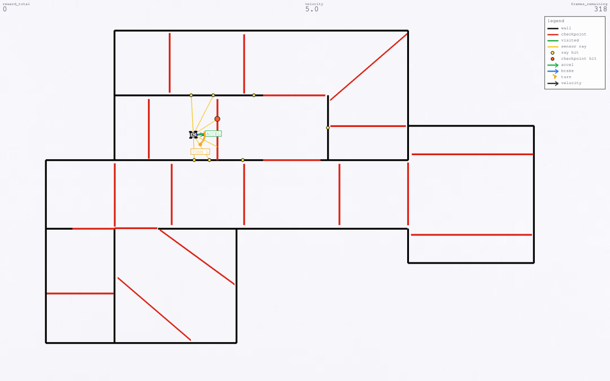
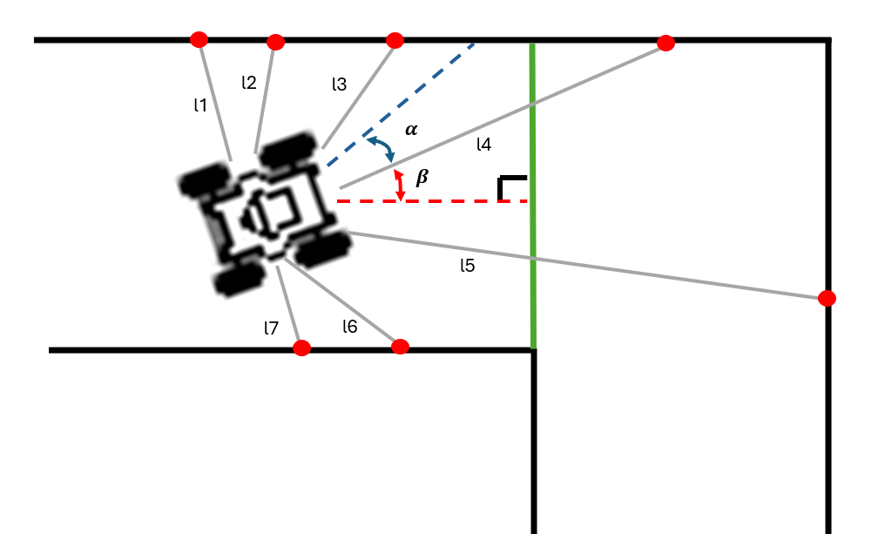
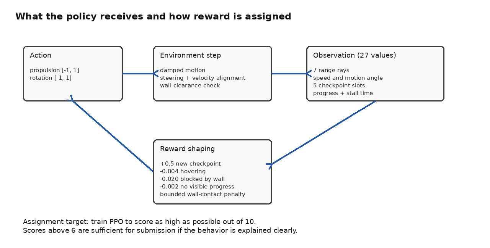

# AI4R Practical Assignment: 2D Checkpoint Exploration

This folder contains the runnable code for the AI4R 2D checkpoint exploration assignment. The task is to train a reinforcement learning agent to drive a 2D robot through a multi-room map and cross as many checkpoint gates as possible.



The figure above is a screenshot from the current Pygame renderer. The yellow observation rays stop at the nearest visible wall or checkpoint intersection; they should not pass through black walls. Red gates are unvisited checkpoints and green gates are already visited checkpoints.

## Assignment Guide

The student handout is available as a PDF:

[AI4R Explore Agent Assignment Guide](docs/AI4R_explore_agent_assignment.pdf)

## Assignment Goal

The map contains `20` checkpoints. Each new checkpoint gives `0.5` reward:

```text
20 checkpoints x 0.5 reward = 10.0 maximum checkpoint reward
```

Try to get as close to `10.0` as possible. A score above `6.0` at any point during the allowed rollout is enough for submission if the report explains the behavior shown in the video. The final reward may be lower if the robot later collides, stalls, or accumulates penalties. A higher and more stable score is better, especially if the behavior does not rely on repeated wall contact. For the final video and score, the rollout may run for up to `1000` steps.

Start with the default setting, `entropy_coeff=0.01`, and first try to reach more than `6.0` during a `1000` step rollout. The provided setup has been tested to reach this target with enough training and without major code changes. After that, change the entropy coefficient for the comparison experiment and explain the behavior in the video report.

Required experiments:

- Train PPO with `entropy_coeff=0.0`.
- Train PPO with `entropy_coeff=0.01` as the default setting.
- Train PPO with `entropy_coeff=0.1`.
- Compare reward curves, checkpoint coverage, wall contact, and visual behavior.
- Explain how the different entropy values changed the observed behavior.

PPO is the default supported algorithm for the assignment. Students may try another RL algorithm if they keep the map, checkpoints, and reward definition fixed. If another algorithm is used for the submitted result, the report must explain the selected algorithm and repeat the exploration-parameter comparison using that algorithm's closest equivalent to `entropy_coeff`.

Required deliverable:

- A short rollout video or presentation segment showing the best rollout.
- The best score and number of checkpoints reached.
- A discussion of successful behavior and failure cases.
- A comparison of all three required entropy settings: `0.0`, `0.01`, and `0.1`, discussed or presented in the video report.
- The best score reached at any time within the allowed rollout length, plus the final score if it is different.
- If the reward drops strongly after reaching a good score, a clear explanation of what went wrong and what was tried to improve it.
- A zip file containing the source code used for the run and the checkpoint used to record the submitted video.

## Assignment Rules

The walls, checkpoint gates, and reward definition define the task and must stay fixed. Students should not edit `rooms_layout.py`, `reward_config.py`, the checkpoint coordinates, the wall geometry, or the reward terms for the submitted result.

Students may change the learning setup around the fixed task. Reasonable changes include PPO hyperparameters, training duration, entropy coefficient, network settings, action scaling, observation handling, and other variables that affect how the policy learns without changing the task itself. Any such change must be explained in the report and compared against the assignment setup shown in the video.

Keep submitted code readable. Comments should explain decisions that are not obvious from the code, for example why a hyperparameter was changed. Avoid large unrelated rewrites, temporary debug code, machine-specific paths, and comments that simply restate what the next line of code already says.

## Code Layout

The code is split so the assignment is easier to read:

```text
run_assignment.py                         # check/train/rollout wrapper
Explore_PPO_agent_training.py             # PPO training script
Explore_DDPG_agent_training.py            # optional DDPG training script
explore_agent_rollout.py                  # trained policy rollout
performance_sanity_check.py               # headless/render speed check
docs/                                     # assignment guide and README figures
├── AI4R_explore_agent_assignment.pdf
├── rooms_task_overview.png
├── original_observation_space.png
└── observation_reward_flow.png
Explore-Agent/explore_agent/envs/
├── exploring_gym.py                      # Gymnasium environment and robot dynamics
├── rooms_layout.py                       # walls and checkpoint map
├── reward_config.py                      # reward constants and task constants
└── start_human.py                        # manual driving
```

Read these first:

- `Explore-Agent/explore_agent/envs/reward_config.py`
- `Explore-Agent/explore_agent/envs/rooms_layout.py`
- `Explore-Agent/explore_agent/envs/exploring_gym.py`
- `Explore_PPO_agent_training.py`
- `Explore_DDPG_agent_training.py` only if you want to try an optional deterministic actor-critic baseline.

## Actions, Observations, Rewards

The action is:

```text
action = [propulsion, rotation]
```

Both values are clipped to `[-1, 1]`.

The default observation shape is `(27,)`. It contains range rays, speed, heading/velocity angle, checkpoint target information, coverage progress, and stall time.

The first `10` values describe the robot's local motion and target direction:

```text
[l1, l2, l3, l4, l5, l6, l7, v, alpha, beta]
```



- `l1..l7`: normalized wall-clearance distances from the range rays.
- `v`: normalized robot speed.
- `alpha`: normalized angle between the robot heading and its current velocity direction.
- `beta`: normalized angle between the robot heading and the selected checkpoint target direction.

The remaining observation values describe several visible unvisited checkpoint candidates, so the policy can choose between multiple exploration directions instead of only reacting to one target.



The default reward mode is `coverage`:

```text
+0.5    crossing a new checkpoint
 0.0    revisiting an already visited checkpoint
-0.004  hovering in explored space
-0.020  being blocked by a wall
-0.002  not getting closer to a visible unvisited checkpoint
bounded wall-contact penalty, accumulating up to -0.5 between new checkpoints
```

Checkpoint reward is only given when the robot crosses a gate. Driving near a checkpoint on the same side does not count.

## Conda Setup

The codebase was developed and tested on Ubuntu/Linux. The commands below use an Ubuntu/Linux shell. Windows and macOS should also work through Conda in theory, but they were not tested end to end for this release.

Platform setup references:

- Ubuntu/Linux Conda install guide: <https://docs.conda.io/projects/conda/en/latest/user-guide/install/linux.html>
- Windows Conda install guide: <https://docs.conda.io/projects/conda/en/latest/user-guide/install/windows.html>
- macOS Conda install guide: <https://docs.conda.io/projects/conda/en/latest/user-guide/install/macos.html>

This README is the run-command guide for the assignment. The command blocks below were tested end to end on Ubuntu/Linux. On Windows, run the same `conda` and `python` commands from Anaconda Prompt or a Conda-enabled PowerShell. On macOS, run them from Terminal after installing Conda. Shell-specific commands such as `source <path-to-miniconda>/etc/profile.d/conda.sh` apply to Linux/macOS terminals only.

The assumption for every platform is that students can install Conda or Miniconda, create the environment, activate it, enter the `Exploring_agent_DRL` folder, and then run the Python commands from this repository.

This assignment does not require heavy GPU compute. A good CPU is enough for training, although an NVIDIA GPU can be used if CUDA is installed correctly. Use the CPU environment unless `nvidia-smi` works and PyTorch reports CUDA as available.

CPU environment:

```bash
conda env create -f environment.yml
conda activate aiar-rl-explore
```

NVIDIA GPU environment:

```bash
conda env create -f environment-gpu.yml
conda activate aiar-rl-explore-gpu
```

If `conda` is not available in a normal Linux terminal, initialize it first. Replace `<path-to-miniconda>` with the actual Miniconda or Anaconda installation path on that machine:

```bash
source <path-to-miniconda>/etc/profile.d/conda.sh
conda activate aiar-rl-explore-gpu
```

For a default Miniconda installation in the home folder, this is often:

```bash
source ~/miniconda3/etc/profile.d/conda.sh
```

Check CUDA before GPU training:

```bash
nvidia-smi
python -c "import torch; print(torch.cuda.is_available()); print(torch.cuda.get_device_name(0) if torch.cuda.is_available() else 'no CUDA')"
```

Use `--num-gpus 1` only if CUDA is available.

## Quick Checks

Headless check:

```bash
python run_assignment.py check --steps 1000
```

Manual driving:

```bash
python Explore-Agent/explore_agent/envs/start_human.py
```

Use the arrow keys. Press `r` to reset.

## Training Commands

Default PPO. Start here:

```text
entropy_coeff = 0.01
```

```bash
python run_assignment.py train --iterations 500 --train-batch-size 2000 --sgd-minibatch-size 256 --num-sgd-iter 10 --num-workers 0 --num-gpus 0 --entropy-coeff 0.01 --checkpoint-dir tmp/ppo_entropy_001
```

GPU version, if CUDA works:

```bash
python run_assignment.py train --iterations 500 --train-batch-size 2000 --sgd-minibatch-size 256 --num-sgd-iter 10 --num-workers 0 --num-gpus 1 --entropy-coeff 0.01 --checkpoint-dir tmp/ppo_entropy_001
```

### Training Length per PPO Iteration

`--iterations` controls how many PPO updates are run. `--train-batch-size` controls how many environment steps are collected before each update. With the default values, training uses roughly:

```text
500 iterations x 2000 environment steps per iteration = 1,000,000 sampled steps
```

Students may change this value if they want longer or shorter PPO updates:

```bash
python run_assignment.py train --iterations 500 --train-batch-size 4000 --num-workers 0 --num-gpus 0 --entropy-coeff 0.01 --checkpoint-dir tmp/ppo_entropy_001_batch4000
```

A larger batch gives PPO a more stable update but each iteration takes longer. A smaller batch gives faster iteration feedback but usually noisier learning.

### PPO Parameters Students Can Tune

Students may adjust the training values to reach the task goal, as long as they keep the map geometry fixed and explain the result.

- `--iterations`: number of collect-and-learn cycles. More iterations usually gives the policy more chances to improve.
- `--train-batch-size`: number of environment steps collected before one PPO update. The default `2000` is about five full `400` step training episodes. Larger values are more stable but slower per iteration.
- `--sgd-minibatch-size`: number of samples used in each optimizer minibatch after the full train batch is collected. It should normally be smaller than `--train-batch-size`.
- `--num-sgd-iter`: number of optimization passes over the collected train batch. Higher values learn more from the same data, but too high can overfit to recent behavior.
- `--entropy-coeff`: entropy coefficient used by PPO. The required report comparison uses `0.0`, `0.01`, and `0.1`.
- `--max-steps`: maximum training episode length. The assignment uses `400` during training and allows up to `1000` during final rollout.
- `--num-workers`: number of Ray rollout workers. Keep `0` for simple local training unless the machine has enough CPU cores.
- `--num-gpus`: use `1` only when CUDA is available; otherwise use `0`.

### Optional RL Algorithms

PPO is the recommended route and the provided report commands are written for PPO. Students may use another RL algorithm if they keep `rooms_layout.py`, `reward_config.py`, the checkpoint gates, the walls, and the reward terms unchanged.

For the required exploration comparison, use the closest parameter for the selected algorithm:

| Algorithm | Exploration parameter to compare |
| --- | --- |
| PPO | `entropy_coeff` |
| A3C | `entropy_coeff` in RLlib, although A3C is deprecated in the installed RLlib version |
| SAC | entropy temperature settings, such as `target_entropy` and `initial_alpha`, not PPO-style `entropy_coeff` |
| DDPG | no entropy coefficient; compare action-noise settings such as `--exploration-initial-scale`, `--exploration-final-scale`, and `--exploration-scale-timesteps` |
| TD3 | no entropy coefficient; compare action-noise settings if a TD3 trainer is added |

Optional DDPG run:

```bash
python run_assignment.py train-ddpg --iterations 1000 --num-workers 0 --num-gpus 0 --checkpoint-dir tmp/ddpg_2d_checkpoint_exploration
```

DDPG checkpoints can be tested with the same rollout command by changing the checkpoint path:

```bash
python run_assignment.py rollout --checkpoint tmp/ddpg_2d_checkpoint_exploration/checkpoint_best --steps 1000 --max-steps 1000 --render-fps 30
```

### Continue Training from a Checkpoint

To continue from an existing checkpoint, pass `--resume-from` and write new checkpoints to a new folder:

```bash
python run_assignment.py train --iterations 300 --resume-from tmp/ppo_entropy_001/checkpoint_best --checkpoint-dir tmp/ppo_entropy_001_resume --num-workers 0 --num-gpus 0 --entropy-coeff 0.01 --train-batch-size 2000
```

Use the same fixed map when resuming. If the map, observation format, or reward mode is changed, old checkpoints may not be compatible or may behave differently from the submitted setup.

## Test a Checkpoint

Visual rollout:

```bash
python run_assignment.py rollout --checkpoint tmp/ppo_entropy_001/checkpoint_best --steps 1000 --max-steps 1000 --render-fps 30
```

Terminal-only rollout:

```bash
python run_assignment.py rollout --checkpoint tmp/ppo_entropy_001/checkpoint_best --steps 1000 --max-steps 1000 --no-gui
```

The rollout prints cumulative reward, checkpoint coverage, maximum checkpoint reward, hover penalty, collision penalty, and progress penalty.

For assessment, use the best score reached at any time within the `1000` step rollout. It does not have to remain above `6.0` until the final frame. However, if the robot reaches a good score and then loses a lot of reward, students should try to troubleshoot the behavior, improve it where possible, and explain the failure clearly after the rollout video.

## Report Discussion Guide

First report the best result obtained with the default PPO entropy setting, `entropy_coeff=0.01`, unless a different algorithm was selected. List the hyperparameters changed from the provided command, such as `--iterations`, `--train-batch-size`, `--sgd-minibatch-size`, `--num-sgd-iter`, network settings, or other PPO/training options. For each change, explain why it was made and how it affected the score or rollout behavior. If another algorithm is used, report the equivalent algorithm-specific hyperparameters instead.

Discuss:

- best reward during the rollout, final reward, and checkpoint count;
- whether the robot enters multiple rooms;
- whether it slows down enough for side checkpoints;
- whether it gets stuck near walls;
- how entropy changes exploration;
- why your best policy succeeds or fails.

For PPO, use the best default `entropy_coeff=0.01` run as the middle case in the entropy comparison. Then run the two additional comparison cases with the same training setup, changing only `--entropy-coeff` and `--checkpoint-dir`:

```bash
python run_assignment.py train --iterations 500 --train-batch-size 2000 --sgd-minibatch-size 256 --num-sgd-iter 10 --num-workers 0 --num-gpus 0 --entropy-coeff 0.0 --checkpoint-dir tmp/ppo_entropy_000
python run_assignment.py train --iterations 500 --train-batch-size 2000 --sgd-minibatch-size 256 --num-sgd-iter 10 --num-workers 0 --num-gpus 0 --entropy-coeff 0.1 --checkpoint-dir tmp/ppo_entropy_010
```

Test each trained checkpoint, including the already trained default `0.01` checkpoint, and report what changed in the reward curve and rollout video. If a different RL algorithm is used, run the same kind of comparison with its exploration parameter and explain which parameter was changed.

Keep the complete submission video below about `5` minutes if possible. The video only needs to show the best rollout. Discuss or present the entropy-coefficient results using concise plots, tables, or spoken explanation; there is no need to include a full rollout for every entropy run. If a short clip from another rollout clearly supports a behavior pattern discussed in the report, it can be included briefly.

A good format is: show the best rollout first, then briefly explain the score, the main behavior, any failure near the end, the most important training changes, and the entropy comparison.

## TensorBoard

Ubuntu/Linux/macOS:

```bash
python -m tensorboard.main --logdir ~/ray_results
```

Windows:

```bat
python -m tensorboard.main --logdir %USERPROFILE%\ray_results
```

Compare reward curves across entropy settings.

## Platform Notes

Ubuntu/Linux is the tested platform for this version. Windows should support CPU and NVIDIA GPU training if Conda, drivers, and CUDA-enabled PyTorch are set up correctly. macOS should use CPU mode. Training is headless by default with `render_mode=None`; visual rollout uses Pygame with a capped FPS. Submit the source code and the trained checkpoint as a separate zip file.
